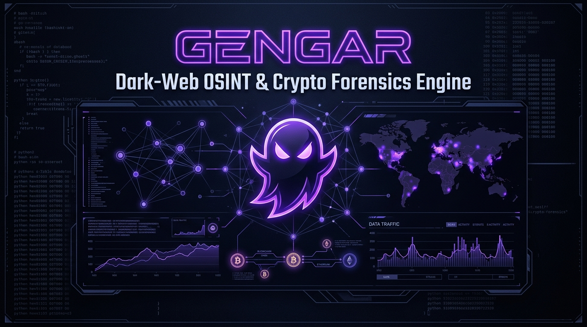

# 👻 Gengar — Dark-Web OSINT Search & Crypto Forensics Platform

<div align="center">


<br/><br/>

[](https://github.com/spideydotjs/gengar/actions/workflows/ci.yml)
[](https://opensource.org/licenses/MIT)
[](https://nodejs.org)
[](https://www.docker.com/)
[](CONTRIBUTING.md)
[](SECURITY.md)

**A high-performance, dark-web investigation and cryptocurrency intelligence engine.**  
*Queries Ahmia hidden services via Tor SOCKS5, probes live `.onion` endpoints, extracts crypto wallets with NLP intent classification, and generates tamper-evident on-chain evidence dossiers.*

[Quick Start](#-quick-start-with-docker-compose-recommended) •
[Features](#-key-features) •
[Architecture](#-architecture) •
[Forensics Engine](#-crypto-forensics--threat-intelligence) •
[Roadmap](#-roadmap) •
[Contributing](#-contributing)

</div>

---

## ⚡ Why Gengar?

Traditional OSINT tools struggle with the volatility and latency of hidden services. **Gengar** bridges dark-web content discovery with on-chain blockchain intelligence into a unified, privacy-first platform:

- **Zero Clearnet Leaks**: Every query, probe, and screenshot routes strictly through Tor SOCKS5 proxy circuits.
- **Resilient Multi-Tier Search**: Combines fast Tor `.onion` HTTP token negotiation, Tor mirror exit routing, and headless Playwright Chromium sessions with aggressive asset filtering.
- **Automated Crypto Forensics**: Instantly maps wallet addresses discovered on `.onion` pages against OFAC sanctions, ransomware syndicates, and darknet market clusters.
- **Court-Admissible Evidence**: Generates cryptographically sealed SHA-256 evidence dossiers with immutable Chain of Custody tracking.

---

## 🏛️ Architecture

```
                       ┌────────────────────────────────────────────────────────┐
                       │                     Gengar Platform                    │
                       └────────────────────────────────────────────────────────┘
                                                    │
                      ┌─────────────────────────────┴────────────────────────────┐
                      ▼                                                          ▼
             [ React Web UI :6700 ]                                    [ Express REST / SSE API ]
       (TailwindCSS • Obsidian Cyberpunk)                          (/api/search, /api/probe, /api/forensics)
                      │                                                          │
                      │                                      ┌───────────────────┴──────────────────┐
                      ▼                                      ▼                                      ▼
           [ Browser Client ]                         [ Prober & Crawler ]                  [ Crypto Forensics ]
                                                             │                                      │
                                                             ▼                                      ▼
                                                  [ Tor SOCKS5 :9050 ]                  [ Mempool / Blockstream ]
                                                             │                          (Dual Engine + Fallback)
                                             ┌───────────────┴───────────────┐                      │
                                             ▼                               ▼                      ▼
                                     [ Ahmia .onion ]                 [ Hidden Service ]      [ Threat Intel DB ]
                                     (Search Engine)                   (.onion Targets)      (OFAC, WannaCry, LockBit)
```

---

## 💻 Key Features

- **👻 Ascii & Cyberpunk UI**: Minimalist obsidian interface with violet glow telemetry, zero heavy image dependencies, and responsive live stats.
- **📡 Dynamic Live Prober**: Live HTTP status code inspection, millisecond latency measurement, and HTML page title resolution for `.onion` services.
- **📸 Headless Visual Snapshots**: Automated screenshot capture of alive `.onion` sites via Playwright Chromium over Tor, with FIFO disk quota management (`GENGAR_SCREENSHOT_QUOTA`).
- **🧠 Recursive NLP Blockchain Scraper**: Crawls internal `.onion` subpages to identify crypto wallets (BTC, ETH, XMR, LTC) and classifies intent using weighted context NLP:
  - `RANSOM_EXTORTION` • `ESCROW_DEPOSIT` • `COMMERCE_PAYMENT` • `DONATION` • `VENDOR_BOND` • `EXCHANGE_MIXER`
- **🔑 PGP Identity & Cross-Onion Linker**: RFC 4880 OpenPGP parsing of public key blocks to extract 40-character fingerprints, Key IDs, and User IDs. Automatically links distinct `.onion` domains operated by the same entity and checks public keyservers (`keys.openpgp.org`) over Tor.
- **🔒 API Key Protection**: Optional Bearer token authorization (`GENGAR_API_KEY`) for secure remote deployments while keeping Docker healthchecks open.

---

## 🐳 Quick Start with Docker Compose (Recommended)

Get the complete stack running in a single command — includes containerized Tor SOCKS5 proxy, Playwright Chromium, Express API, and the React UI:

```bash
# 1. Clone the repository
git clone https://github.com/spideydotjs/gengar.git
cd gengar

# 2. Spin up containers
docker compose up -d
```

Open **[http://localhost:6700](http://localhost:6700)** in your browser!

### Useful Docker Commands
```bash
# View live application logs
docker compose logs -f

# Check container health status
docker compose ps

# Stop and remove containers
docker compose down
```

---

## 🛠️ Manual / Local Setup (Without Docker)

### Prerequisites

| Requirement | Version / Specification |
|---|---|
| **Node.js** | `>= 20.0.0` |
| **Tor Daemon** | Running on `127.0.0.1:9050` (SOCKS5) |

```bash
# Start Tor locally (Ubuntu / Debian)
sudo apt install tor && sudo systemctl start tor

# Start Tor locally (macOS)
brew install tor && brew services start tor

# Verify SOCKS5 proxy is listening
curl --socks5-hostname 127.0.0.1:9050 https://check.torproject.org/api/ip
```

### Installation

```bash
# Install root dependencies
npm install

# (Optional) Install client dependencies if modifying the frontend
cd client && npm install && cd ..
```

### Run Gengar

```bash
# Start backend and serve pre-built React UI
npm start

# Development mode with hot-reloading backend
npm run dev

# Run unit tests
npm test
```

---

## 🕵️‍♂️ Crypto Forensics & Threat Intelligence

Available directly within the Web UI dashboard or programmatically via `/api/forensics/*`:

- **Transaction Ledger Tracking**: Real-time UTXO, inputs/outputs, fee rates, and transfer directions powered by dual Mempool & Blockstream engines.
- **Criminal Threat Correlation**: Cross-references addresses against verified threat actors:
  - **Ransomware**: WannaCry, LockBit 3.0, BlackCat/ALPHV, DarkSide/Colonial Pipeline
  - **Darknet Markets**: Silk Road (FBI seized), Hydra Market (BKA seized), AlphaBay, Garantex
  - **Mixers & Tumblers**: Blender.io (OFAC SDN), ChipMixer (DoJ/Europol seized), Tornado Cash
  - **Regulated Exchanges**: Binance, Kraken, Coinbase (KYC / Subpoena preservation targets)
- **Darknet Heuristics**: Automated detection of money-laundering **peeling chains** and **CoinJoin mixer signatures**.
- **Tamper-Evident Evidence Vault**: Generates legal Chain of Custody records and cryptographically sealed SHA-256 evidence dossiers (`data/evidence/CASE-YYYY-XXXX.json`) with immutable versioned snapshots.

---

## 🌐 API Reference

### Health & Tor Status
- `GET /api/health` — Service health check & active proxy status.
- `GET /api/tor-status` — Verifies Tor circuit connectivity and exit node IP.

### Search & Prober
- `GET /api/search?q=<query>&probe=true` — Search Ahmia and optionally probe live hidden services.
- `GET /api/search/stream?q=<query>` — Server-Sent Events (SSE) stream providing real-time crawl telemetry.
- `POST /api/probe` — Probe specific `.onion` URLs for status, title, and latency.

### Blockchain OSINT & Forensics
- `POST /api/blockchain-scan` — Crawl a `.onion` site recursively for cryptocurrency wallets.
- `GET /api/blockchain-scan/stream?url=<onionUrl>` — Live SSE stream of discovered wallets and NLP classifications.
- `POST /api/forensics/track` — Run on-chain ledger analysis, heuristic clustering, and threat correlation.
- `GET /api/forensics/cases` — List all sealed evidence dossiers in the vault.
- `POST /api/forensics/case/note` — Append examiner notes to a case file and re-seal cryptographic hash.

### PGP Identity & Fingerprint Intelligence
- `GET /api/pgp/identities` — List all unique PGP identities discovered across crawl dossiers.
- `GET /api/pgp/identity/:fingerprint` — Get full identity dossier, cross-onion domain linkage, and wallets for a PGP fingerprint.
- `POST /api/pgp/parse` — Parse and decode any custom armored PGP public key block on demand.
- `GET /api/pgp/keyserver/:fingerprint` — Query public keyserver (`keys.openpgp.org`) over Tor for clearnet email linkage.

---

## ⚙️ Environment Variables

Copy `.env.example` to `.env` to configure your environment:

| Variable | Default (Local) | Default (Docker) | Description |
|---|---|---|---|
| `PORT` | `6700` | `6700` | HTTP listen port |
| `HOST` | `0.0.0.0` | `0.0.0.0` | Host binding address |
| `TOR_SOCKS` | `socks5h://127.0.0.1:9050` | `socks5h://tor:9050` | Tor SOCKS5 proxy URL |
| `TOR_HOST_PORT` | `9052` | `9052` | Host port mapped to Tor container |
| `GENGAR_API_KEY` | *(empty)* | *(empty)* | Optional Bearer token for API authentication |
| `GENGAR_EXAMINER` | `OPERATOR_LOCAL` | `OPERATOR_LOCAL` | Default examiner identifier recorded in evidence |
| `GENGAR_SCREENSHOT_QUOTA` | `200` | `200` | Maximum screenshots stored before FIFO eviction |

---

## 🗺️ Roadmap

- [x] Multi-tier Ahmia `.onion` search engine with browser fallback
- [x] Real-time SSE crawling streams
- [x] Automated visual screenshot capture over Tor
- [x] Bitcoin & multi-currency regex wallet extraction
- [x] NLP context intent classification (Ransom, Escrow, Donation)
- [x] On-chain UTXO tracing and peeling chain heuristics
- [x] Cryptographic SHA-256 evidence vault with Chain of Custody
- [x] OpenPGP RFC 4880 parsing & cross-onion entity correlation
- [ ] **Multi-chain tracking**: Support for EVM (Ethereum, Arbitrum) and TRON (USDT TRC-20)
- [ ] **Interactive Visual Graph**: Node-link graph visualization of transaction hops and co-spent clusters
- [ ] **Tor Circuit Cycling**: On-demand NEWNYM signaling for automated circuit rotation
- [ ] **Threat Format Export**: Export dossiers in standardized STIX 2.1 and MISP threat formats

---

## 🤝 Contributing

Contributions make the open-source community an incredible place to learn, inspire, and create. Any contributions you make are **greatly appreciated**.

Please review our [Contributing Guidelines](CONTRIBUTING.md) and [Code of Conduct](CODE_OF_CONDUCT.md) before submitting pull requests.

```bash
# Run tests before creating a PR
npm test
npm run build:client
```

---

## ⚖️ Legal & Ethical Notice

This software is strictly developed for **academic research, lawful open-source intelligence (OSINT), and authorized cybersecurity investigations**. 

Users are solely responsible for compliance with all local and international laws governing dark-web access and network probing. The developers assume no liability for misuse.

---

## 📄 License

Distributed under the **MIT License**. See [`LICENSE`](LICENSE) for more information.

<div align="center">
  <sub>Built with 👻 by <a href="https://github.com/spideydotjs">spideydotjs</a> and contributors.</sub>
</div>
